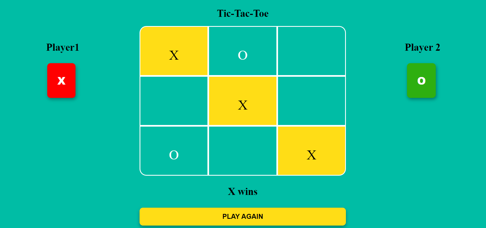

# Tic-Tac-Toe Game

This is a modern, web-based implementation of the classic Tic-Tac-Toe game. Designed with a user-friendly interface and vibrant styling, this game allows two players to take turns as "X" and "O" on a 3x3 grid. The game automatically tracks and highlights the winning combination while announcing the result, making it easy to follow along. Players can quickly reset the game with the "Play Again" button, ensuring smooth and continuous gameplay.

## Features

- Play as Player 1 (X) or Player 2 (O) in a turn-based manner. The game automatically switches between players after each move.
- The winning line (whether horizontal, vertical, or diagonal) is highlighted in yellow, making it easy to see the winning move.
- Current player symbols (X and O) are displayed on the left and right sides of the game board, indicating whose turn it is in a clear and attractive way.
- The game board and buttons feature colorful and modern styling, with each player's move (X in red, O in green) clearly distinguished for easy identification.
- A message is displayed below the board to announce the result when a player wins (e.g., "X wins").
- After the game ends, a "PLAY AGAIN" button appears, allowing players to easily reset the board and start a new game without refreshing the page.

## Tech Stack

- HTML
- CSS
- Javascript

## Installation

To run the project, simply open the `index.html `file in browser.

## Screenshot

